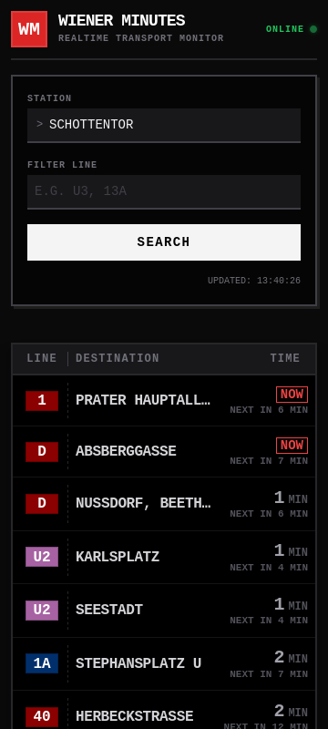

<div align="center">
  
  <h1>Wiener Minutes</h1>
  
  <p>
    <strong>No bloat. Just the countdown.</strong><br>
    A terminal-styled, real-time departure monitor for Vienna public transport.
  </p>

  <p>
    <a href="https://omartrj.github.io/wminutes/">🔴 <strong>Launch App</strong></a>
  </p>

  <br />

  
</div>

<br />

### Why?
I built this because I wanted something faster and less bloated than the official app. I just needed to know when my tram was coming without navigating through menus. It’s built to look cool on mobile, load instantly, and give you that "station display" vibe.

Built with **React**, **TypeScript**, and **Vite**.


### API Integration

The app talks directly to the [Wiener Linien Realtime API](https://digitales.wien.gv.at/open-data/).
It hits this endpoint:
`https://www.wienerlinien.at/ogd_realtime/monitor`

The only parameter that matters is `diva` — that's the internal ID for each station.

More informations about the API can be found [here](https://www.data.gv.at/datasets/cfba4373-a654-3e0b-80f8-348738169f95?locale=de)

**The CORS Workaround:**
While the API supports HTTPS, it doesn't send the necessary CORS headers (`Access-Control-Allow-Origin`) for direct browser requests from other domains. To bypass this without setting up a server, I'm piping the traffic through `corsproxy.io`.

### Development

To run this project locally:

1.  **Install dependencies:**

    ```bash
    npm install
    ```

2.  **Run the development server:**

    ```bash
    npm run dev
    ```

3.  **Open the app:**
    Visit [http://localhost:3000](http://localhost:3000) in your browser.